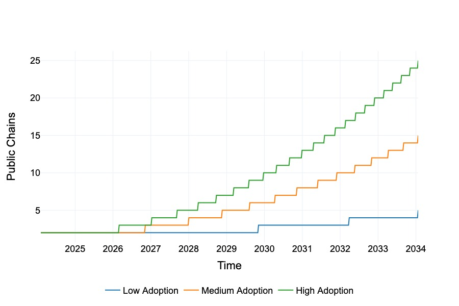

# Growth Scenario Modeling

**Overview**

This section provides an in-depth analysis of the economic model proposed for BBN. It includes simulations, visualizations, and evaluations of various economic parameters and scenarios that could impact the BBN ecosystem.

**Purpose**

We aim to:

- Simulate the economic outcomes of different scenarios within the network.
- Analyze the impact of various factors such as transaction fees, validator rewards, and staking mechanisms on the overall economy.
- Provide insights and visualizations to understand the potential economic stability and growth of the ecosystem.

## Incentivization Scenarios

The potential incentivization scenarios for BBN's validator rewards:
1. **No Rewards Policy** : Validators receive only the chain fees and the 2% emissions as rewards. The token economy operates without additional
incentives, allowing for natural market movements with no fixed guarantee on APY.

2. **Maintain APY Policy** : To keep the Annual Percentage Yield (APY) for stakers around 4%. The incentives are adjusted to maintain the current stakers' APY at approximately 4%. There is no provision to attract new stakers unless the APY is increased above this threshold.

3. **Maintain APY and Price Policy** : To preserve a ~4% APY for stakers while keeping the token price stable. The BBN treasury manages the reward distribution to balance the APY at its initial value, assuming the sales of tokens are onset by an influx of new stakers. Assumes that rewards are distributed entirely in stablecoins.

4. **Maintain APY and Price Policy with Tokens** : Ensuring a ~4% APY for stakers with a stable token price, but compensating in BBN tokens. This introduces a selling pressure, as tokens are transferred from the treasury to the open market.

## No Rewards Policy

**Parameters**

- Initial Supply: 21 billion BBN
- Yearly Emissions: Capped at 4% for the first decade, 2% for
validator incentives and another 2% for the Community Treasury
- Number of validators: 100
- Operational Cost: $100000 per year per validator
- Minimum % of supply staked: 35%

### Adoption Rate

Adoption scenarios for the BBN platform are categorized into low, medium, and high, with the final number of PoS chains as 5, 10 and 15 respectively. Over the period of 10 years, utilizing Stochastic Process Realization we visualize the adoption rate. In a simplified manner and with some presuppositions, these can be considered the bear, base and bull scenarios for the BBN ecosystem.

### Validator Yield

Considering that the target baseline is 4% APY, we can observe that:

- **Low Adoption Scenario**: The yield does not reach the desired 4% mark within the simulation period, indicating that extra incentives might be necessary throughout the period to achieve the target yield. The additional incentives required range from 1% to 0.6%.
  
- **Medium Adoption Scenario**: The yield seems to reach the desired 4% mark at approximately 5 years from the start time. This implies that additional incentives might be needed for the first 5 years to maintain the desired yield until the network naturally progresses to that yield rate.

- **High Adoption Scenario**: The yield reaches the desired 4% mark quite early, around 3 years from the genesis, suggesting that extra incentives from the treasury might only be necessary in the initial few years.

This demonstrates the impact of adoption rates and on the economic incentives and suggests that during the initial years, all scenarios would fall short of the desired yield. The strategic use of treasury incentives could be crucial for early network growth and achieving desired validator yields.

### Treasury Inflow

The chart illustrates the treasury inflow trajectory throughout the 10-year simulation. Notably, in the absence of supplementary incentives for validators, we observe a consistent increase in inflow. Inferring from the requirements from the above sub-section, especially during the early years, it is conceivable that the treasury might be stretched thin in its efforts to subsidize the additional incentives for validators.